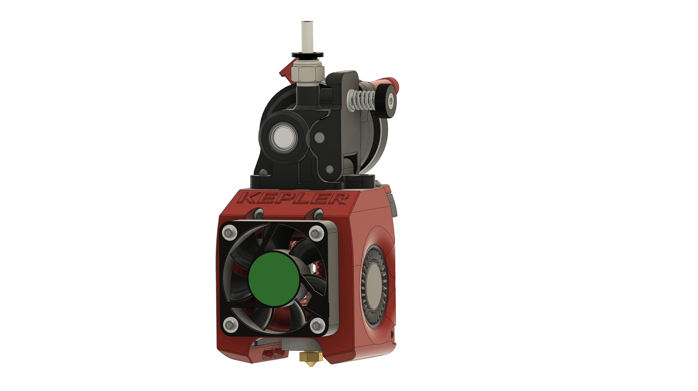

# Kepler Tool Head

Derived from the Micron and Mini-Afterburner Tool Heads

#Use at your own risk - this is still a work in progress.

I'm running this on a Salad Fork build. Better overhang results and extrusion consistency so far as compared to the Micron toolhead.

This only supports the Dragon Hot End at this time

## BOM

- (1) Orbiter v1.5
- (1) Dragon Hot End - Standard or Hi-Flow variants
- (1) Pancake Stepper Toolhead PCB
- (2) 4010 Radial Fans - whatever voltage you prefer
- (1) 4010 Axial Fan - whatever voltage you prefer
- (4) M3x10 BHCS Hot End Fan
- (4) M3 Hexnuts Hot End Fan
- (2) M3x35 SHCS Main Mounting Screws
- (1) M3x6 3rd Mounting Point
- (4) M3x8 BHCS Carriage Mount
- (2) M3x20 SHCS Klicky Mount
- (2) M3x10 BHCS Blower Anchors (optional?)
- (2) M3x10 BHCS Orbiter Mount
- (2) M3x6 PCB Anchors
- Zip Ties to keep it neat

Assembly Tips:
- Remove the upper ears on the 4010 Radials
- Insert the (2) M3x35 SHCS before installing the Hot End Fan
- Route the Hot End Fan wires down and through the fan hole, merge with the 4010 Radial Fan through the nut channel
- Assemble the Hot End Fan before the Radials, the nuts will be mostly captivated once the 4010 Radials are inserted
- Be mindful of the wires - the loops are enough for the part fans, thermocouple, and Hot End Fan.
- Heater wires hang loose at this stage, zip tie to the secured fan wires to keep them from dangling
